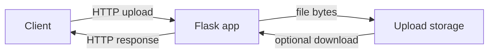

## Executive summary

The requested toy Flask upload service could not be reviewed directly because the declared input path `skill-pair-redteam/fixtures/pack_b/run_001/` is not present in the benchmark workspace. This threat model is therefore limited to confirmed benchmark metadata plus conditional risks for a Flask file-upload service. The highest-risk themes for a Flask upload surface are unsafe file storage/serving, unrestricted upload size or type, path traversal through filenames or download paths, and production misconfiguration such as exposed debug mode.

## Scope and assumptions

In scope:
- Declared service path: `skill-pair-redteam/fixtures/pack_b/run_001/`.
- Available workspace evidence: `bootstrapped_inputs.json`.
- Relevant exposed guidance: `security-threat-model` and `security-best-practices` Flask guidance.

Out of scope:
- Source-code-specific route, function, and configuration findings, because no Flask service files are present in the workspace.
- External network, credentials, privileged paths, or unrelated files.

Assumptions:
- The target is a toy Flask web service that accepts file uploads.
- The service may expose at least one HTTP endpoint for upload, and may optionally expose a route for listing or downloading uploaded files.
- Authentication, deployment model, and data sensitivity are unknown.

Open questions:
- Is the service intended to be internet-exposed or local-only?
- Are uploads anonymous, authenticated, or admin-only?
- Are uploaded files sensitive, public, or mixed-sensitivity?

## System model

### Primary components

- Browser or HTTP client: submits multipart upload requests.
- Flask application: parses request metadata and uploaded file content.
- Upload storage: filesystem directory or equivalent local storage for uploaded files.
- Optional download/list route: serves stored files back to clients.

Evidence anchor:
- `bootstrapped_inputs.json` declares `skill-pair-redteam/fixtures/pack_b/run_001` as the copied workspace input, but the path is absent from the workspace.

### Data flows and trust boundaries

- Client -> Flask application: multipart HTTP form data and filenames cross from an untrusted client into server-side request parsing. Authentication, rate limiting, CSRF controls, and content-length limits are unknown because source files are unavailable.
- Flask application -> Upload storage: uploaded bytes and metadata cross from application memory into persistent local files. Filename normalization, extension allowlists, content validation, and storage location are unknown.
- Flask application -> Client: responses may include upload status, file lists, or file downloads. Safe content disposition, MIME handling, and path validation are unknown.

#### Diagram

## Assets and security objectives

| Asset | Why it matters | Security objective (C/I/A) |
|---|---|---|
| Uploaded file contents | May contain user data, malware-like payloads, HTML/JS, or oversized content | C/I/A |
| Upload storage path | Unsafe writes can overwrite files or fill disk | I/A |
| Flask process and host filesystem | Path traversal or unsafe serving can expose or corrupt server files | C/I/A |
| Application availability | Large files or many multipart parts can exhaust memory/disk | A |
| User/browser trust | Inline serving of uploaded active content can enable XSS | C/I |

## Attacker model

### Capabilities

- Submit HTTP requests and multipart uploads to exposed endpoints.
- Control uploaded filename, extension, MIME type, and file bytes.
- Repeat requests to attempt storage exhaustion if rate and size limits are absent.
- Request uploaded-file retrieval routes if such routes exist.

### Non-capabilities

- No assumed shell, filesystem, or credential access outside normal HTTP interactions.
- No assumed ability to modify server configuration or deployment environment.
- No source-code-specific privilege escalation path can be asserted without the service files.

## Entry points and attack surfaces

| Surface | How reached | Trust boundary | Notes | Evidence (repo path / symbol) |
|---|---|---|---|---|
| Upload endpoint | HTTP multipart request | Untrusted client -> Flask parser | Conditional: expected for a toy Flask upload service | Task prompt says "toy Flask upload service"; source path missing |
| Uploaded filename handling | Multipart `filename` field | Untrusted metadata -> filesystem path | Must not trust original filename as storage path | Conditional from Flask upload-service class |
| Uploaded bytes/content type | Multipart file body | Untrusted bytes -> storage and optional serving | Requires size, type, and active-content controls | Conditional from Flask upload-service class |
| Optional download/list endpoint | HTTP request | Untrusted client -> storage read | Must prevent path traversal and serve safely | Conditional; source unavailable |

## Top abuse paths

1. Attacker uploads a file with a traversal filename -> app joins it with the upload directory unsafely -> file is written outside intended storage -> server files are overwritten or planted.
2. Attacker uploads HTML or SVG with script content -> app serves it inline from a trusted origin -> victim opens file -> attacker script runs in the site origin.
3. Attacker uploads very large files or many multipart fields -> Flask/WSGI process or disk accepts them without limits -> memory, disk, or worker availability is exhausted.
4. Attacker uploads a disguised executable or polyglot file -> app validates only the extension or MIME header -> unsafe content is stored and later consumed by users or downstream tools.
5. Attacker requests a download path such as `../app.py` -> app uses direct file I/O or `send_file` with untrusted path -> local source or config files are disclosed.

## Threat model table

| Threat ID | Threat source | Prerequisites | Threat action | Impact | Impacted assets | Existing controls (evidence) | Gaps | Recommended mitigations | Detection ideas | Likelihood | Impact severity | Priority |
|---|---|---|---|---|---|---|---|---|---|---|---|---|
| TM-001 | Remote uploader | Upload route accepts attacker-controlled filenames | Use traversal or confusing filename to escape upload directory | File overwrite, planted content, or storage corruption | Upload storage, host filesystem | Not verifiable; source missing | Filename/path handling unknown | Use `secure_filename` only as normalization, generate random server-side storage names, store outside static roots, use `safe_join`/`send_from_directory` for reads | Log rejected filenames and path-normalization failures | Medium | High | High |
| TM-002 | Remote uploader | App serves uploaded active formats inline | Upload HTML/SVG/JS-capable content and induce viewing | XSS in application origin | User/browser trust, sessions if present | Not verifiable; source missing | Content-type and serving behavior unknown | Allowlist file types, verify content, serve untrusted files as attachments, add `X-Content-Type-Options: nosniff` and CSP | Alert on uploads of active content extensions or MIME mismatches | Medium | High | High |
| TM-003 | Remote uploader | Request/body limits absent or too high | Send large uploads or many multipart parts repeatedly | Disk, memory, or worker exhaustion | Availability, storage | Not verifiable; source missing | `MAX_CONTENT_LENGTH`, form limits, edge limits unknown | Set `MAX_CONTENT_LENGTH`, `MAX_FORM_MEMORY_SIZE`, `MAX_FORM_PARTS`, and reverse-proxy limits; add rate limiting | Monitor upload failures, request size, disk usage, 413s, worker restarts | High | Medium | High |
| TM-004 | Remote client | Download route accepts user-selected path or filename | Request traversal paths or guessed file IDs | Local file disclosure or cross-user file access | Uploaded files, source/config files | Not verifiable; source missing | Download route unknown | Use opaque file IDs, authorization checks where needed, `send_from_directory`, and deny direct arbitrary paths | Log invalid file IDs and traversal patterns | Medium | High | High |
| TM-005 | Remote client | Production deploy exposes Flask debug server | Trigger debugger or use dev server under load | Remote code execution risk if debugger exposed; weak availability | Flask process, host | Not verifiable; source missing | Deployment config unknown | Disable debug in production, use gunicorn/uWSGI or managed WSGI, environment-based config | Monitor startup config and block debug mode in production CI | Low | Critical | Medium |

## Criticality calibration

- Critical: exposed Flask debugger with interactive console; unauthenticated path traversal that enables code overwrite and execution.
- High: arbitrary file write outside upload storage; inline serving of attacker-controlled HTML/JS; local file disclosure through download traversal.
- Medium: upload-driven disk exhaustion; missing security headers around uploaded content; weak MIME validation with limited downstream exposure.
- Low: missing production hardening whose exploitability depends on external infrastructure, such as `TRUSTED_HOSTS` with no external URL generation.

## Focus paths for security review

| Path | Why it matters | Related Threat IDs |
|---|---|---|
| `skill-pair-redteam/fixtures/pack_b/run_001/` | Declared in-scope service directory, but absent from workspace | TM-001, TM-002, TM-003, TM-004, TM-005 |
| `bootstrapped_inputs.json` | Confirms the benchmark expected `run_001` to be copied into the workspace | All |

## Quality check

- Covered discovered entry points: only the declared service input and conditional upload-service surfaces could be covered.
- Covered each modeled trust boundary in threats: client-to-Flask, Flask-to-storage, storage-to-client.
- Runtime vs CI/dev separation: runtime upload risks are separated from production debug/deployment concerns.
- User clarification: no interactive clarification was requested because the benchmark stage asks for a completed artifact and the source input is absent.
- Assumptions and open questions are explicit.
