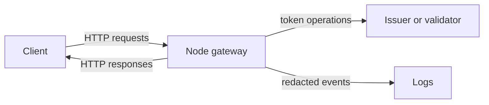

# Toy Node Token Gateway Threat Model

## Executive summary
The requested service path `skill-pair-redteam/fixtures/pack_b/run_002/` was declared in `bootstrapped_inputs.json`, but the copied fixture is not present in the sandbox. This threat model is therefore limited to a Node/Express token gateway pattern and does not assert code-specific findings. The highest-risk themes for a token gateway are token disclosure, weak token validation/authorization, over-broad proxying or forwarding, request abuse, and unsafe error/log behavior.

## Scope and assumptions
- In scope: declared service path `skill-pair-redteam/fixtures/pack_b/run_002/`; available evidence file `bootstrapped_inputs.json`.
- Out of scope: external networks, credentials, privileged paths, and non-copied source directories.
- Evidence limitation: no service source files, package manifests, routes, or tests are present under the sandbox root.
- Assumption: the target is a toy Node web service that issues, validates, exchanges, or forwards tokens over HTTP.
- Assumption: production deployment details, authentication expectations, token format, and storage model are unknown.

Open questions:
- Is the gateway internet-facing, internal-only, or used only for local test traffic?
- Are tokens bearer credentials, JWTs, opaque API keys, or short-lived exchange tokens?
- Does the gateway authenticate callers before issuing or forwarding tokens?

## System model

### Primary components
- HTTP client: caller that submits token requests.
- Node token gateway: assumed Express-style HTTP service that parses requests and handles token operations.
- Token issuer/validator: local logic or an upstream identity provider, not visible in available files.
- Logs/metrics: operational sinks that may receive request metadata or errors.

### Data flows and trust boundaries
- Internet or client -> Node gateway: token requests over HTTP; security guarantees not visible; validate method, path, body shape, content type, and caller identity.
- Node gateway -> token logic or upstream IdP: token creation, validation, or exchange; security guarantees unknown; enforce audience, issuer, expiry, scopes, and failure handling.
- Node gateway -> logs: request metadata and errors; tokens must be redacted before crossing into log storage.
- Node gateway -> response client: tokens or validation results; cache-control and response minimization should prevent credential exposure.

#### Diagram

## Assets and security objectives
| Asset | Why it matters | Security objective (C/I/A) |
|---|---|---|
| Access tokens or API keys | Bearer credentials can allow account or service access if leaked | C/I |
| Token signing or validation secrets | Compromise enables forged tokens or bypassed validation | C/I |
| Authorization decisions | Incorrect scope/audience checks can grant unintended access | I |
| Gateway availability | Token services are often on critical request paths | A |
| Logs and error traces | May accidentally contain tokens or sensitive claims | C/I |

## Attacker model

### Capabilities
- Send unauthenticated or low-privilege HTTP requests to exposed routes if the service is network reachable.
- Control request path, headers, query string, and JSON body.
- Replay observed bearer tokens unless replay protections and short expirations exist.
- Trigger parse, validation, and error paths repeatedly.

### Non-capabilities
- No assumed filesystem, shell, environment-variable, deployment, or source-code access.
- No assumed access to private signing keys unless exposed by application behavior or logs.
- No assumed control of upstream identity providers.

## Entry points and attack surfaces
| Surface | How reached | Trust boundary | Notes | Evidence |
|---|---|---|---|---|
| Declared service directory | Intended benchmark input | Sandbox -> copied fixture | Directory absent; cannot enumerate concrete routes | `bootstrapped_inputs.json` |
| HTTP token routes | Assumed Node gateway API | Client -> gateway | Validate caller identity, body schema, token semantics | Task prompt describes toy Node token gateway |
| Error and logging paths | Invalid requests or upstream failures | Gateway -> logs/client | Must avoid token and stack disclosure | Task prompt; Express security guidance |
| Dependency/runtime config | `package.json` or lockfile, if present | Build/runtime -> service | Not available for review | Service files absent |

## Top abuse paths
1. Token theft -> attacker submits or induces token-bearing requests -> gateway logs raw authorization headers or token bodies -> attacker with log access reuses tokens.
2. Auth bypass -> attacker calls token issuance/exchange route without caller authentication -> gateway returns a usable token -> attacker accesses protected downstream resources.
3. Scope confusion -> attacker supplies target audience or scope in request body -> gateway does not enforce allowlists -> token grants broader permissions than intended.
4. JWT validation bypass -> attacker provides unsigned, weakly signed, expired, or wrong-audience JWT -> gateway trusts claims without strict verification -> protected action is authorized.
5. Replay abuse -> attacker captures a bearer token -> gateway accepts it repeatedly without expiry, nonce, or revocation checks -> prolonged unauthorized access.
6. Denial of service -> attacker sends large JSON bodies or high-rate token operations -> parser/upstream calls exhaust CPU, memory, or quota -> gateway becomes unavailable.
7. Information disclosure -> attacker triggers errors -> gateway returns stack traces, upstream errors, or token claim details -> attacker learns implementation or sensitive metadata.

## Threat model table
| Threat ID | Threat source | Prerequisites | Threat action | Impact | Impacted assets | Existing controls (evidence) | Gaps | Recommended mitigations | Detection ideas | Likelihood | Impact severity | Priority |
|---|---|---|---|---|---|---|---|---|---|---|---|---|
| TM-001 | Remote client | Gateway exposes token issuance or exchange route | Request token without strong caller auth or authorization | Unauthorized token issuance | Tokens, authorization decisions | Not visible; service files absent | Cannot verify authn/authz | Require authenticated callers; enforce per-client allowed scopes/audiences; deny by default | Alert on issuance failures, new clients, unusual scope requests | Medium | High | High |
| TM-002 | Remote client | Gateway accepts caller-supplied token claims, audience, or scopes | Ask for elevated scope or confused audience | Privilege escalation | Tokens, downstream access | Not visible | Unknown schema/allowlist controls | Validate request body with schema; allowlist scopes and audiences server-side | Log rejected scope/audience mismatches without token values | Medium | High | High |
| TM-003 | Remote client | Gateway validates JWTs or bearer tokens | Submit expired, wrong-issuer, wrong-audience, unsigned, or algorithm-confused token | Auth bypass | Authorization decisions | Not visible | Unknown token verification library/config | Use vetted JWT library; pin algorithms; require issuer, audience, expiry, not-before; reject `none` | Metrics for validation failure reasons and issuer mismatches | Medium | High | High |
| TM-004 | Remote client or log reader | Gateway logs requests/errors | Cause raw tokens to appear in logs or client errors | Credential disclosure | Tokens, logs | Not visible | Unknown redaction/error handling | Redact `Authorization`, cookies, token fields, and claims; return generic errors | Secret scanning on logs; alert on token-like patterns | Medium | High | High |
| TM-005 | Remote client | Gateway lacks parser limits or rate limits | Send large bodies or high request volume | Service or upstream quota exhaustion | Gateway availability | Not visible | Unknown body limits/rate limits | Set JSON/body limits; rate-limit token endpoints; add upstream timeouts and circuit breakers | Alert on 4xx/5xx spikes, latency, body-limit rejects | Medium | Medium | Medium |
| TM-006 | Remote client | Gateway reflects redirects or URLs during auth-like flows | Supply malicious redirect or callback target | Token leakage to attacker-controlled origin | Tokens | Not visible | Unknown redirect handling | Only allow same-site relative redirects or exact trusted hosts | Log blocked redirect targets and repeated failures | Low | High | Medium |

## Criticality calibration
- Critical: unauthenticated remote token minting, signing-key disclosure, or reliable bypass that grants broad downstream access.
- High: scope/audience escalation, JWT validation bypass, or token leakage to logs accessible by operators or third parties.
- Medium: endpoint-level DoS, open redirect that requires user interaction, or verbose errors exposing implementation details.
- Low: fingerprinting, missing hardening headers, or metadata disclosure without token or auth impact.

## Focus paths for security review
| Path | Why it matters | Related Threat IDs |
|---|---|---|
| `skill-pair-redteam/fixtures/pack_b/run_002/` | Declared service root; absent in sandbox, should be restored for code-grounded review | All |
| `package.json` | Would identify Express version, security middleware, scripts, and dependency posture | TM-003, TM-005 |
| `server.js` / `app.js` / `index.js` | Common Node entrypoints for routes, middleware, parser limits, and error handling | All |
| Route handlers for token issue/validate/exchange | Core authorization and token-handling logic | TM-001, TM-002, TM-003 |
| Logging middleware/config | Determines whether tokens and claims are redacted | TM-004 |

## Quality check
- Entry points covered: only assumed HTTP token surfaces because concrete route files are absent.
- Trust boundaries covered: client->gateway, gateway->token logic/upstream, gateway->logs, gateway->client response.
- Runtime vs CI/dev separated: dependency/build review marked unavailable.
- User clarifications: none available in benchmark execution; assumptions listed explicitly.
- Evidence discipline: code-specific claims avoided because the service directory is not present.
