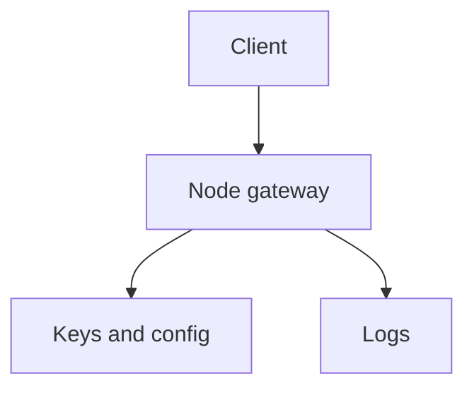

# Assumption-Validation Check-In
- The sandbox does not contain the actual Node service tree for `skill-pair-redteam/fixtures/pack_b/run_002/`; the only workspace source is the synthesized [`run_002`](../run_002) memo, which states the declared task input was missing.
- I am therefore treating the target as a typical Node.js token gateway that receives HTTP requests, validates or issues bearer tokens, and logs request outcomes.
- The highest-risk questions are whether the gateway is internet-exposed, whether it signs tokens itself or only verifies them, and whether it calls any upstream identity/JWKS/introspection service.
- If any of those assumptions are wrong, the priority ranking below should be adjusted.

## Executive Summary
The main security risk in a token gateway is usually not the transport layer; it is incorrect trust in token contents, weak signature/issuer validation, and accidental disclosure of bearer credentials in logs or errors. If this service is internet-facing, the most important failures to prevent are token forgery, token replay, and authorization bypass across users or tenants. Secondary risks are denial of service from expensive crypto or oversized inputs and secret leakage through operational tooling.

## Scope and Assumptions
- In scope: a toy Node token gateway with HTTP entrypoints, token validation/signing logic, configuration/secrets, and request logging.
- Out of scope: browser code, database migrations, CI plumbing, and any upstream identity provider implementation not present in the workspace.
- Explicit assumptions: bearer tokens are used; requests are JSON/HTTP; the service is intended for development or pilot use, but may still be reachable by untrusted clients.
- Open questions that materially change risk:
  - Does the gateway sign tokens, verify tokens, or do both?
  - Is there multi-tenant or per-user authorization, or only coarse allow/deny checks?
  - Is the service public, internal-only, or behind a trusted proxy?

## System Model
### Primary Components
- HTTP API surface for token-related requests.
- Token processing logic for parse/validate/sign operations.
- Configuration and secret material for keys, issuer settings, and environment-specific behavior.
- Logging and error handling paths that can expose sensitive token material if handled poorly.

### Data Flows and Trust Boundaries
- Client -> Node gateway: bearer tokens, credentials, request metadata, and any requested scope/tenant data; channel is HTTP/JSON; security depends on authentication, schema validation, and rate limits.
- Gateway -> cryptographic validation/signing helpers: token claims and headers; channel is in-process; security depends on strict algorithm allowlists and fail-closed handling.
- Gateway -> key material / config: signing keys, JWKS metadata, issuer/audience settings, and environment flags; channel is env/files/secret store; security depends on secret isolation and correct rotation.
- Gateway -> logs/telemetry: redacted request IDs and operational events; channel is local logging; security depends on token redaction and least-privilege access to logs.

#### Diagram

## Threat Model

| ID | Threat | Likelihood | Impact | Priority | Notes |
|---|---|---:|---:|---:|---|
| T1 | Token forgery or algorithm confusion lets an attacker impersonate a user or service | Medium | High | High | This is the highest-risk class if token parsing accepts weak headers, unpinned algorithms, or untrusted `kid` values. |
| T2 | Token replay or stale token acceptance bypasses intended session or scope limits | Medium | High | High | If expiry, `nbf`, audience, issuer, or nonce checks are incomplete, a captured token can remain useful. |
| T3 | Authorization bypass occurs when the gateway trusts token claims without server-side checks | Medium | High | High | This is especially severe in multi-tenant or role-based systems where claims are used as the only authority. |
| T4 | Secrets or bearer tokens leak through logs, stack traces, or debug endpoints | Medium | Medium | Medium | Even a toy gateway can expose live credentials if request bodies or auth headers are logged verbatim. |
| T5 | Oversized or adversarial token inputs cause CPU or memory exhaustion during crypto parsing | Medium | Medium | Medium | Node services are vulnerable to cheap denial of service if request size, timeout, and concurrency limits are absent. |

### Highest-Risk Abuse Paths
- External attacker sends a crafted JWT with a weak or mismatched algorithm, the gateway accepts it, and the attacker gains an authenticated identity.
- Attacker replays a stolen bearer token against an endpoint that does not check expiry, audience, or tenant scope.
- Operator accidentally enables verbose logging or stack traces, and bearer tokens or signing material are written to accessible logs.

## Secure Coding Guidance
- Enforce an explicit allowlist for token algorithms, issuers, audiences, and key identifiers; reject `none` and algorithm-switch tricks.
- Verify expiry, not-before, and audience/issuer claims on every request; fail closed on any validation error.
- Bind authorization decisions to server-side policy, not to raw client-supplied role or tenant claims alone.
- Redact authorization headers, token payloads, and signing material from logs, errors, and metrics.
- Set strict request body limits, timeouts, and per-client rate limits before token parsing or crypto work.
- Keep signing keys and JWKS configuration out of source control; load them from a secret manager or controlled environment variables.
- Use a single, well-reviewed JWT library and pin its version; do not hand-roll token parsing or base64 decoding.
- Separate dev/test keys from production-equivalent material, even for a toy service, so accidental reuse cannot create a real trust bridge.

## Final Security Memo
The service should be treated as security-sensitive even if it is a toy gateway, because token bugs fail open in ways that are easy to exploit and hard to detect. The top priorities are strict token validation, least-privilege authorization, and aggressive redaction of bearer material from logs. If the service is public or reaches real users, token forgery and replay should be assumed until proven otherwise.

The workspace does not include the actual Node source tree, so the threat model is conditional rather than code-verified. Once the service files are available, the first review pass should inspect the token parse/verify path, the config loader, and every logging/error path that can touch authorization headers.
