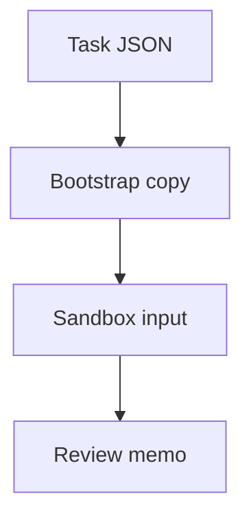

# B6 Security Memo

## Executive summary
The provided `service_dir` does not contain a Python CLI config loader. The sandboxed fixture is a plain-text benchmark memo that says it was generated because the declared input was missing, so the main security issue is provenance failure: a substituted artifact can redirect analysis away from the intended code and produce a false sense of coverage. No code-level vulnerabilities in a loader can be validated from the supplied material.

## Scope and assumptions
- In scope: the benchmark task definition, the copied sandbox input, and the substituted fixture content in `run_003`.
- Out of scope: any actual Python CLI loader source, because no Python files were provided in the sandboxed input.
- Assumption: the real loader was omitted from the copied task input rather than deleted from the benchmark.
- Assumption: the benchmark harness is the only actor that can write the substituted fixture into the workspace.
- Open questions: where the real loader source lives, whether missing `service_dir` should fail closed, and whether the benchmark is intentionally testing poisoned inputs.

## System model
### Primary components
- Benchmark task definition: declares `service_dir` and the requested review.
- Bootstrap/copy step: places the declared input into the sandbox workspace.
- Sandbox input file: `run_003`, which contains a prose memo rather than code.
- Analyst/review process: consumes the sandbox input and produces the security memo.

### Data flows and trust boundaries
- Task JSON -> benchmark bootstrap: task metadata specifies the expected service path. Boundary: benchmark configuration to execution.
- Bootstrap -> sandbox file: the harness writes the copied input into the workspace. Boundary: harness-controlled content to analyst-controlled review context.
- Sandbox file -> analyst output: the reviewer reads the fixture and writes the memo. Boundary: untrusted input to conclusions.

#### Diagram

## Assets and security objectives
| Asset | Why it matters | Security objective |
| --- | --- | --- |
| Intended loader source code | This is the actual subject of the review. | Integrity |
| Task provenance | Determines whether the review is grounded in the requested code. | Integrity |
| Review conclusions | Downstream decisions depend on them. | Integrity |
| Benchmark workspace artifacts | Must not be confused with the real service input. | Integrity |

## Attacker model
### Capabilities
- Can influence the review outcome if the benchmark supplies an unrelated or substituted input.
- Can exploit ambiguity when the declared `service_dir` is missing or replaced with prose.

### Non-capabilities
- No evidence of remote network access, authentication bypass, or code execution from the provided fixture.
- No evidence that the input can read secrets or reach external systems.

## Entry points and attack surfaces
| Surface | How reached | Trust boundary | Notes | Evidence |
| --- | --- | --- | --- | --- |
| Copied benchmark input | Loaded from the sandbox workspace | Bootstrap -> review context | The file is text, not source code. | `run_003` |
| Task declaration | Read from the benchmark task JSON | Task metadata -> execution | Declares a Python CLI review target that is not present in the sandboxed input. | `__validation__pack_b_tasks.json` |

## Top abuse paths
1. Missing `service_dir` is replaced with a prose memo, and the reviewer unknowingly analyzes the wrong artifact, which yields false coverage.
2. A downstream workflow treats the memo as authoritative context and skips the absent code review entirely.
3. The substituted text influences conclusions about the intended CLI review even though it contains no loader implementation details.
4. Benchmark provenance is not checked, so the workspace artifact is mistaken for the real service source.

## Threat model table
| Threat ID | Threat source | Prerequisites | Threat action | Impact | Impacted assets | Existing controls (evidence) | Gaps | Recommended mitigations | Detection ideas | Likelihood | Impact severity | Priority |
| --- | --- | --- | --- | --- | --- | --- | --- | --- | --- | --- | --- | --- |
| T1 | Benchmark harness or fixture generation path | Declared input is missing or substituted | Writes unrelated prose into the expected service location | The review is no longer grounded in the intended codebase | Task provenance, review conclusions | `bootstrapped_inputs.json` records the copied path | No fail-closed check that the input matches the requested service type | Validate presence and type of the expected artifact before review; abort on mismatch | Alert when the copied input is not a Python source tree or package | High | Medium | High |
| T2 | Reviewer workflow | Analyst trusts the sandbox file at face value | Treats the memo as if it were the service under review | Missed vulnerabilities in the actual loader, or a false claim that the review is complete | Intended loader source code, review conclusions | The task prompt names a Python CLI config loader | No evidence of code in the provided input | Require a source-tree inventory step and record the actual reviewed files | Flag reviews with zero `.py` files or no parser/config entrypoints | High | Medium | High |
| T3 | Poisoned benchmark content | The memo is consumed by another automation step | Injects misleading context into later analysis or reporting | Downstream decisions are based on a non-code artifact | Review memo, downstream summaries | None observed | No content provenance labeling in the fixture itself | Mark substituted fixtures as synthetic and non-authoritative; isolate them from code-review runs | Compare expected vs actual MIME/type and directory shape before ingestion | Medium | Medium | Medium |

## Secure coding guidance for the absent CLI loader
- Fail closed when the expected config file, package, or module is missing; do not substitute unrelated text or defaults that hide the failure.
- Treat CLI arguments, environment variables, and config files as untrusted input.
- Validate config schema explicitly; reject unknown keys and type mismatches.
- Use safe parsers and avoid dynamic execution, shell interpolation, or import-by-string from config values.
- Canonicalize and restrict file paths before opening them; prevent traversal and unintended directory escape.
- Avoid logging secrets, tokens, or full config blobs; redact sensitive fields at the boundary.

## Final memo
The concrete finding here is not in the loader implementation, which was not provided. The actionable security issue is the benchmark input itself: the declared Python CLI service was replaced with a prose memo, creating a provenance and scope-confusion risk that can invalidate the review. The right remediation is to make the benchmark input validation fail closed and to require a real source tree before any security assessment proceeds.

